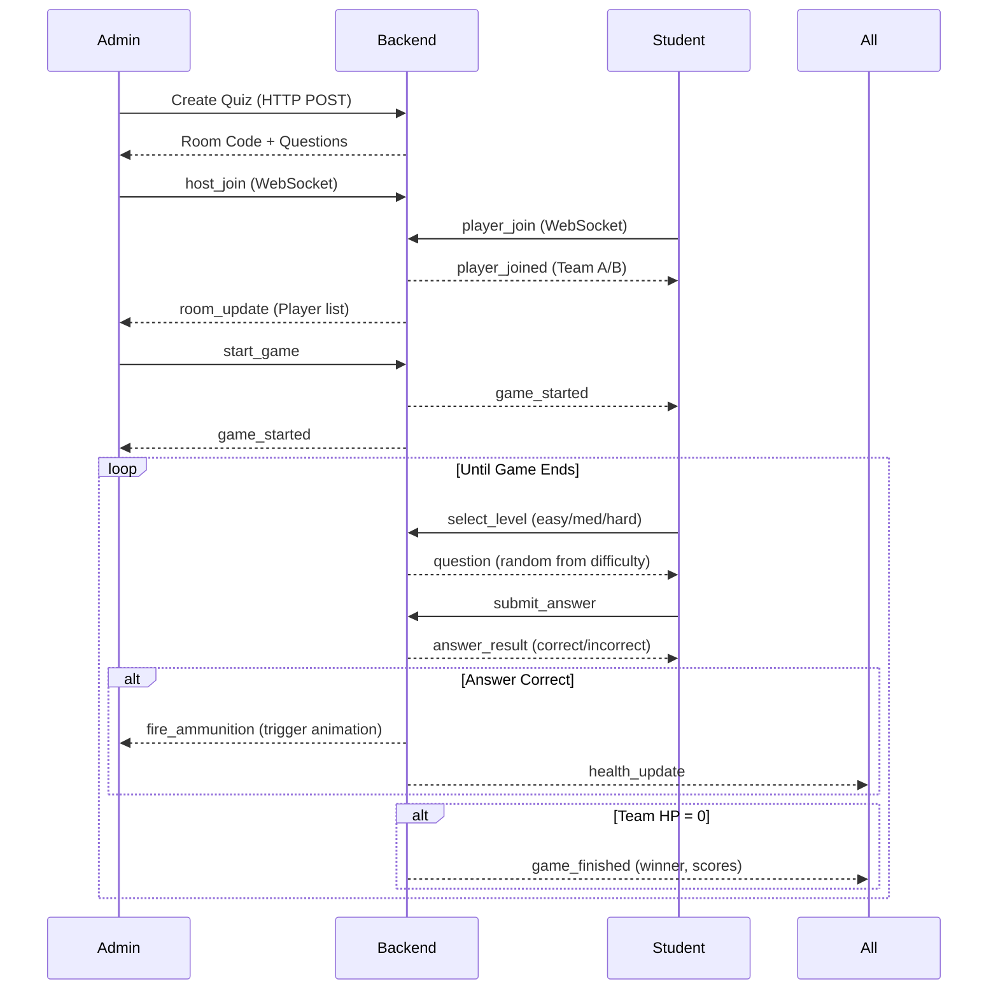

# 🎮 BattleMania - Real-time Quiz Battle Game

An interactive multiplayer quiz game where two teams battle in a 3D tank warfare environment. Students answer questions to fire ammunition at opposing teams, with real-time 3D animations and WebSocket-powered gameplay.

## 🌟 Overview

BattleMania combines education with entertainment by transforming quiz questions into an epic tank battle. Teachers create quizzes, students join teams, and correct answers translate into tank fire and turret missiles in a stunning 3D battlefield.

## 🎯 Game Concept

### Teacher Experience
1. **Create Battle** - Generate AI-powered quiz questions
2. **Wait for Players** - Students join and get auto-assigned to teams
3. **Start Battle** - Launch the 3D battle view
4. **Watch Live** - See tanks and turrets fire as students answer correctly
5. **View Results** - See winning team and player scores

### Student Experience
1. **Join Game** - Enter 4-digit code and name
2. **Select Difficulty** - Choose Easy (10 dmg), Medium (20 dmg), or Hard (30 dmg)
3. **Answer Question** - 30 seconds to select correct answer
4. **See Results** - Watch enemy team take damage
5. **Repeat** - Continue until a team reaches 0 HP
6. **Game Over** - View final scores and play again

## 📁 Project Structure

```
battlemania/
├── src/
│   ├── admin/              # Teacher/Admin components
│   │   ├── AdminDashboard.tsx    # Main admin landing page
│   │   └── BattleMode.tsx        # Unified battle management
│   │                             # States: form → lobby → battle → results
│   │
│   ├── quiz/               # Student components
│   │   └── JoinGame.tsx          # Unified student experience
│   │                             # States: code → name → waiting → playing → results
│   │
│   ├── 3d-game/            # 3D battle scene
│   │   ├── components/
│   │   │   ├── CleanBattleScene.tsx    # Main 3D scene with tanks/turrets
│   │   │   ├── HealthBarOverlay.tsx     # Health bars overlay
│   │   │   └── ScoreCard3D.tsx          # 3D score cards
│   │   ├── store/
│   │   │   └── gameStore.ts             # Zustand store for 3D state
│   │   ├── utils/
│   │   │   └── healthDamageSystem.ts    # Health/damage management
│   │   └── config/                      # Game configurations
│   │
│   └── App.tsx             # Route definitions
│
└── 3d-quiz-be/             # Backend server
    └── src/
        └── index.ts        # Express + WebSocket server
```

## 🛣️ Routes Architecture

### Single Route Pattern (No Disconnections!)

Both admin and student flows stay on **single routes** throughout the game to maintain WebSocket connections.

#### Student Routes
```
/join                    # All student states handled here
  ├─ state: 'code'      → Enter game code
  ├─ state: 'name'      → Enter player name + WebSocket connects
  ├─ state: 'waiting'   → Waiting for teacher to start
  ├─ state: 'playing'   → Select difficulty + answer questions
  └─ state: 'results'   → Game over, view scores
```

#### Admin Routes
```
/admin                           # Admin dashboard
/admin/battle-field             # All admin states handled here
  ├─ state: 'form'      → Create quiz form
  ├─ state: 'creating'  → AI generating questions
  ├─ state: 'lobby'     → Wait for students + WebSocket connects
  ├─ state: 'battle'    → Full-screen 3D battle view
  └─ state: 'results'   → Game over, view results
```

**Why Single Route?** Route changes cause React component unmounting, which closes WebSocket connections. By using internal state transitions, WebSocket stays alive throughout the entire game session.

## 🔌 WebSocket Architecture

### Connection Lifecycle

#### Student Side
```
1. User enters name → WebSocket connects to ws://localhost:3001
2. Sends: player_join → Receives: player_joined (assigned to team)
3. Receives: game_started → Shows difficulty selection
4. Sends: select_level (easy/medium/hard) → Receives: random question
5. Sends: submit_answer → Receives: answer_result + health_update
6. Loop steps 4-5 until game ends
7. Receives: game_finished → Shows results
8. Connection stays alive until user clicks "Play Again"
```

#### Admin Side
```
1. Quiz created → WebSocket connects to ws://localhost:3001
2. Sends: host_join → Receives: host_joined + team lists
3. Receives: room_update (as students join)
4. Sends: start_game → Battle view activates
5. Receives: fire_ammunition → Triggers 3D animation
6. Receives: health_update → Syncs 3D health bars
7. Receives: game_finished → Shows results
8. Connection stays alive until user navigates away
```

### WebSocket Events

| Event | Direction | Purpose |
|-------|-----------|---------|
| `host_join` | Client → Server | Admin connects to room |
| `host_joined` | Server → Client | Confirmation with room data |
| `player_join` | Client → Server | Student joins room |
| `player_joined` | Server → Client | Confirmation with team assignment |
| `room_update` | Server → All | Player list updated |
| `start_game` | Client → Server | Admin starts the game |
| `game_started` | Server → All | Game has begun |
| `select_level` | Client → Server | Student picks difficulty |
| `question` | Server → Client | Random question sent |
| `submit_answer` | Client → Server | Student submits answer |
| `answer_result` | Server → Client | Correct/incorrect + score |
| `fire_ammunition` | Server → Host | Correct answer → trigger animation |
| `health_update` | Server → All | Team health changed |
| `scores_update` | Server → All | Scores updated |
| `end_game` | Client → Server | Admin manually ends game |
| `game_finished` | Server → All | Game over, show results |

## 🎨 3D Animation System

### Integration with WebSocket Events

When a student answers correctly:

1. **Backend** calculates damage based on difficulty
2. Sends `fire_ammunition` event to teacher
3. **BattleMode** receives event and:
   - Triggers appropriate animation (tank/turret)
   - Syncs health to 3D scene
   - Shows notification

### Animation Types

```typescript
// Easy/Medium Questions
window.dispatchEvent(new CustomEvent('battle:fireTank', { 
  detail: { player: 'player1' } // Team Blue fires
}))
// → Tank fires bullet projectile

// Hard Questions  
window.dispatchEvent(new CustomEvent('battle:fireTurret', { 
  detail: { player: 'player2' } // Team Red fires
}))
// → Turret fires missile
```

### Health System

- Backend: 100 HP per team
- 3D Scene: Zustand store manages visual health
- Sync function: `syncHealthTo3D(teamAHealth, teamBHealth)`
- Visual: Health bars above tanks + floating health cards

## 🚀 Setup & Running

### Prerequisites
- Node.js (v18+)
- npm or pnpm
- Anthropic API key (for AI question generation)

### 1. Install Dependencies

```bash
# Frontend
npm install

# Backend
cd 3d-quiz-be
npm install
```

### 2. Configure Environment

Create `3d-quiz-be/.env`:
```env
ANTHROPIC_API_KEY=your_api_key_here
PORT=3001
```

Create `.env` in root (optional):
```env
VITE_QUIZ_API_URL=http://localhost:3001
VITE_WS_URL=ws://localhost:3001
```

### 3. Start Development Servers

```bash
# Terminal 1 - Backend (port 3001)
cd 3d-quiz-be
npm run dev

# Terminal 2 - Frontend (port 5173)
npm run dev
```

### 4. Open in Browser

- **Admin**: http://localhost:5173/admin
- **Students**: http://localhost:5173/join

## 🎮 How to Play

### As Teacher (Admin)

1. Navigate to http://localhost:5173/admin
2. Click "Battle Mode" card
3. Fill in quiz details:
   - Subject (Math, Science, History, etc.)
   - Grade Level
   - Number of questions per difficulty
   - Topic
4. Click "Create Battle"
5. Share the 4-digit code with students
6. Wait for students to join (auto-assigned to teams)
7. Click "Start Battle!" when ready
8. Watch the 3D battle unfold!
   - Toggle controls visibility with eye icon
   - View real-time health bars
   - See player scores updating
   - Watch animations when students answer
9. Game ends automatically at 0 HP
10. View detailed results screen

### As Student

1. Navigate to http://localhost:5173/join
2. Enter the 4-digit game code
3. Enter your name
4. Wait for teacher to start
5. When game starts:
   - Select difficulty (Easy/Medium/Hard)
   - Answer the question (30 seconds)
   - See if you were correct
   - Repeat until game ends
6. View final results
7. Click "Play Again" to join another game

## 🏗️ Technical Architecture

### Frontend Stack
- **React 18** with TypeScript
- **React Router** for navigation
- **React Three Fiber** for 3D rendering
- **Rapier Physics** for tank physics
- **Zustand** for 3D game state
- **Redux Toolkit** for app state (legacy)
- **Vite** for build tooling

### Backend Stack
- **Express** for REST API
- **WebSocket (ws)** for real-time communication
- **Anthropic Claude** for AI question generation
- **TypeScript** for type safety

### Key Design Decisions

1. **Single Route Architecture**
   - Prevents WebSocket disconnections from route changes
   - Maintains stable connections throughout gameplay
   - Better UX with no loading screens between states

2. **Custom Event System**
   - Bridges WebSocket events to 3D animations
   - Decouples networking from rendering
   - Allows independent testing of components

3. **Health Synchronization**
   - Backend is source of truth (game logic)
   - 3D scene reflects backend state (visualization)
   - Sync function ensures consistency

4. **Team Assignment**
   - Auto-balanced (players assigned to smaller team)
   - Persists through reconnections
   - Stored in backend room state

## 🔧 Configuration

### Game Balance
Located in `3d-quiz-be/src/index.ts`:

```typescript
// Damage values
Easy: 10 HP
Medium: 20 HP  
Hard: 30 HP

// Starting health
Each team: 100 HP

// Game end condition
Any team reaches 0 HP
```

### 3D Scene Settings
Located in `src/3d-game/config/gameConfig.ts`:
- Camera position and FOV
- Tank scales and colors
- Bullet speed and physics
- Environment colors

## 🐛 Troubleshooting

### WebSocket Connection Issues

**Problem**: "Connection error" on student/admin side

**Solutions**:
1. Check backend is running on port 3001: `lsof -i :3001`
2. Check backend logs for errors
3. Verify `ANTHROPIC_API_KEY` is set in `.env`
4. Try restarting both frontend and backend

### Route Disconnection Issues

**Problem**: WebSocket disconnects during gameplay

**Cause**: This was fixed! Ensure you're using the latest code where:
- Student stays on `/join` throughout
- Admin stays on `/admin/battle-field` throughout
- No `navigate()` calls during gameplay

### 3D Scene Not Loading

**Problem**: Black screen or "Game not found"

**Solutions**:
1. Check browser console for Three.js errors
2. Verify all 3D models exist in `public/models/`
3. Check GPU acceleration is enabled in browser
4. Try a different browser (Chrome/Firefox recommended)

## 📊 Game Flow Diagram



## 🎨 Features

### AI-Powered Question Generation
- Uses Anthropic Claude to generate contextual questions
- Automatically balances difficulty levels
- Customizable topics and grade levels

### Real-Time Multiplayer
- WebSocket-based instant updates
- Auto-balanced team assignment
- Handles reconnections gracefully

### 3D Battle Visualization
- Realistic tank models and physics
- Day/night environment with clouds
- Stadium with spectators
- Dynamic bullet and missile effects
- Real-time health bars

### Responsive Design
- Works on desktop browsers
- Optimized UI for both admin and students
- Accessible color schemes

## 🔐 Security Considerations

### Current Implementation (Development)
- All WebSocket connections accepted
- No authentication required
- Suitable for local/classroom use

### Production Recommendations
- Add user authentication
- Implement room passwords
- Rate limit API endpoints
- Validate all WebSocket messages
- Use HTTPS/WSS in production
- Add CORS restrictions

## 📈 Performance

### Optimizations Implemented
- Model preloading with useGLTF.preload
- Suspense boundaries for lazy loading
- Efficient WebSocket message handling
- Zustand for minimal re-renders
- Physics engine optimization

### Recommended Specs
- **Backend**: 1 CPU, 512MB RAM (handles ~50 concurrent players)
- **Frontend**: Modern browser with WebGL 2.0 support
- **Network**: Low latency (<100ms) for smooth gameplay

## 🧪 Testing

### Manual Testing Checklist

**Admin Flow**:
- [ ] Create quiz with valid inputs
- [ ] See lobby with game code
- [ ] Players appear as they join
- [ ] Start battle button enables
- [ ] 3D scene renders on start
- [ ] Fire animations trigger
- [ ] Health bars update
- [ ] Game ends at 0 HP
- [ ] Results show correctly

**Student Flow**:
- [ ] Enter valid game code
- [ ] Enter name and join
- [ ] See waiting screen
- [ ] Game starts, see difficulty selection
- [ ] Select difficulty, receive question
- [ ] Answer within 30 seconds
- [ ] See correct/incorrect result
- [ ] Return to difficulty selection
- [ ] Game ends, see results
- [ ] Play again works

**WebSocket Stability**:
- [ ] No "Component unmounting" messages
- [ ] Connection stays alive during gameplay
- [ ] Reconnection works if network drops
- [ ] Multiple students can join
- [ ] Handles student leaving gracefully

## 📝 Environment Variables

### Backend (`3d-quiz-be/.env`)
```env
ANTHROPIC_API_KEY=sk-ant-...           # Required: Claude API key
PORT=3001                               # Optional: Server port (default: 3001)
```

### Frontend (`.env`)
```env
VITE_QUIZ_API_URL=http://localhost:3001    # Optional: Backend HTTP URL
VITE_WS_URL=ws://localhost:3001            # Optional: Backend WebSocket URL
```

## 🚢 Deployment

### Backend Deployment

```bash
cd 3d-quiz-be
npm run build
npm start

# Or use Docker
docker build -t battlemania-backend .
docker run -p 3001:3001 -e ANTHROPIC_API_KEY=xxx battlemania-backend
```

### Frontend Deployment

```bash
npm run build
# Deploy dist/ folder to static hosting (Vercel, Netlify, etc.)

# Update environment variables to point to production backend
VITE_QUIZ_API_URL=https://your-backend.com
VITE_WS_URL=wss://your-backend.com
```

## 🔮 Future Enhancements

### Potential Features
- [ ] Multiple game modes (Free-for-all, Capture the Flag)
- [ ] Power-ups and special abilities
- [ ] Custom team names and colors
- [ ] Voice chat integration
- [ ] Spectator mode
- [ ] Leaderboards and statistics
- [ ] Question bank management
- [ ] Game replay system
- [ ] Mobile responsive design
- [ ] Accessibility improvements

## 🤝 Contributing

### Development Workflow

1. Create feature branch
2. Make changes
3. Test locally (both admin and student flows)
4. Ensure no linter errors: `npm run lint`
5. Build successfully: `npm run build`
6. Submit PR with description

### Code Style
- TypeScript strict mode
- ESLint for code quality
- Functional React components
- Zustand for state management
- Clear component responsibilities

## 📄 License

[Add your license here]

## 👥 Credits

Built with:
- [React](https://react.dev/)
- [Three.js](https://threejs.org/) via [React Three Fiber](https://docs.pmnd.rs/react-three-fiber)
- [Rapier Physics](https://rapier.rs/)
- [Anthropic Claude](https://www.anthropic.com/claude)
- [WebSocket](https://developer.mozilla.org/en-US/docs/Web/API/WebSocket)

## 📞 Support

For issues or questions:
1. Check troubleshooting section above
2. Review `WEBSOCKET_DEBUG.md` for connection issues
3. Check `NO_ROUTE_CHANGE_FIX.md` for architecture details
4. Review backend logs and browser console

## 🎓 Educational Use

Perfect for:
- Classroom quiz review
- Remote learning engagement
- Test preparation
- Gamified assessments
- Student engagement activities

---

**Ready to Battle?** Start your servers and let the quiz warfare begin! ⚔️🎮
